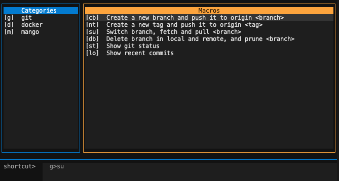
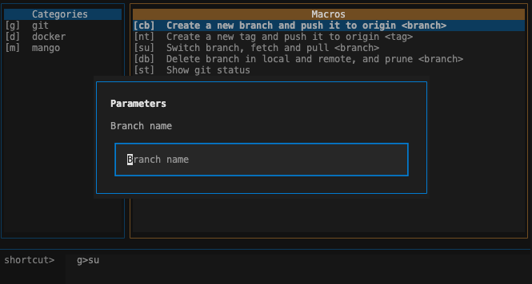

<div align="center">

# 🥭 mango

**A keyboard-driven TUI for running your shell command sequences — no more copy-pasting the same commands.**

[](https://pypi.org/project/mango-tui/)
[](https://pypi.org/project/mango-tui/)
[](LICENSE)

</div>

---



---

## Install

```bash
pip install mango-tui
```

Requires Python 3.10+.

## Run

```bash
mango
```

That's it. On first run mango creates its config at `~/.config/mango/` and opens the TUI.

---

## How it works

mango lets you define **macros** — named sequences of shell commands — grouped by category. You pick one from the TUI and it runs, streaming output to the bottom panel in real time.

Macros that need input (a branch name, a service, a version tag) show a prompt dialog before running.



---

## Keyboard reference

| Key | Action |
|---|---|
| `↑` / `↓` | Move through the list |
| `←` / `→` | Switch between category and macro panels |
| `Enter` | Run the selected macro |
| `Tab` / `Shift+Tab` | Cycle focus (categories → macros → shortcut bar) |
| `q` | Quit |

### Shortcut mode

Type `<category>><macro>` at any time to jump straight to a macro without using the menus:

```
g>bs   →  git › switch-and-pull
g>bc   →  git › create-branch-push
d>cu   →  docker › up
```

---

## Built-in macros

mango ships with a set of common macros ready to use:

### `g` — Git

| Shortcut | Description |
|---|---|
| `g>bc` | branch \| create and push |
| `g>bd` | branch \| delete local, remote and prune |
| `g>br` | branch \| rename local and remote |
| `g>bs` | branch \| switch and pull |
| `g>cf` | clean \| remove untracked files |
| `g>gl` | git \| show recent commits |
| `g>gs` | git \| show status |
| `g>mb` | merge \| branch into current |
| `g>rh` | reset \| hard to HEAD |
| `g>ru` | reset \| undo last commit |
| `g>sc` | stash \| create |
| `g>sp` | stash \| pop |
| `g>tc` | tag \| create and push |

### `d` — Docker

| Shortcut | Description |
|---|---|
| `d>cb` | container \| build and start |
| `d>cd` | container \| stop |
| `d>ce` | container \| exec shell |
| `d>cl` | container \| follow service logs |
| `d>cp` | container \| prune stopped |
| `d>cr` | container \| restart service |
| `d>cu` | container \| start |

### `n` — Node

| Shortcut | Description |
|---|---|
| `n>nc` | ncu \| check outdated deps |
| `n>nd` | ncu \| doctor mode (safe upgrade) |
| `n>nu` | ncu \| upgrade all deps |

### `m` — Mango

| Shortcut | Description |
|---|---|
| `m>mu` | mango \| upgrade |

---

## Adding your own macros

Create `~/.config/mango/config.local.yaml`. Your macros are merged with the built-in defaults and survive package upgrades.

```yaml
categories:
  git:
    shortcut: "g"          # must match an existing category exactly to add macros into it
    macros:
      cleanup:
        shortcut: "cl"
        description: "Delete merged branches"
        steps:
          - git branch --merged | grep -v main | xargs git branch -d

  tools:                   # a new category — key and shortcut must not exist in the defaults
    shortcut: "t"
    macros:
      hello:
        shortcut: "hi"
        description: "Say hello"
        steps:
          - echo "hello world"
```

### Macros with parameters

Use `params` to collect input before the steps run. Reference each param in steps as `{name}`:

```yaml
categories:
  tools:
    shortcut: "t"
    macros:
      deploy:
        shortcut: "dp"
        description: "Deploy to an environment"
        params:
          - name: env
            prompt: "Environment (staging/prod)"
        steps:
          - ./deploy.sh {env}
          - echo "Deployed to {env}"
```

---

## Config files

mango manages three files under `~/.config/mango/` (respects `$XDG_CONFIG_HOME`):

| File | What it is |
|---|---|
| `config.default.yaml` | Built-in macros — overwritten on each update |
| `config.local.yaml` | **Your macros** — edit this one |
| `commands.yaml` | Merged result read by the app — do not edit |

### Merge rules

- To **add macros into an existing category**: use the same category key and shortcut as the default.
- To **add a new category**: both the key and shortcut must not conflict with any default.
- Within a shared category, each local macro key and shortcut must be unique.

Conflicts are skipped and reported before the TUI opens:

```
[mango] config conflict: macro 'git>status' — key already defined in default (skipped)
```

---

## YAML schema reference

```yaml
categories:
  <category-key>:
    shortcut: "g"            # unique globally; one or more chars
    macros:
      <macro-key>:
        shortcut: "su"       # unique within its category
        description: "..."
        params:              # optional
          - name: branch
            prompt: "Branch name"
        steps:               # run sequentially; first non-zero exit aborts
          - git checkout {branch}
          - git fetch
          - git pull
```
